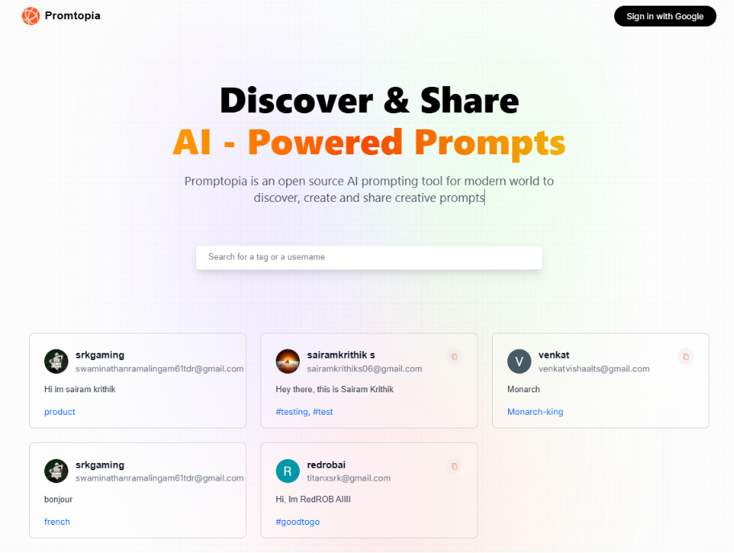
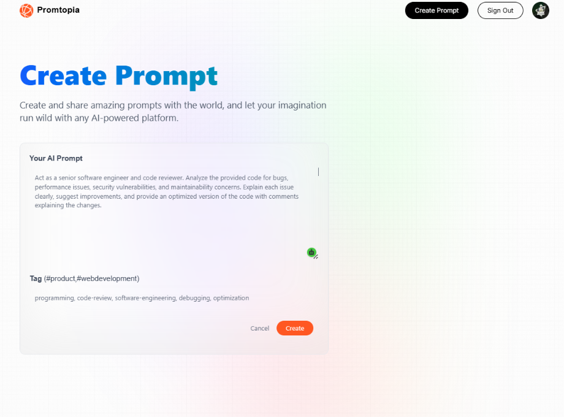
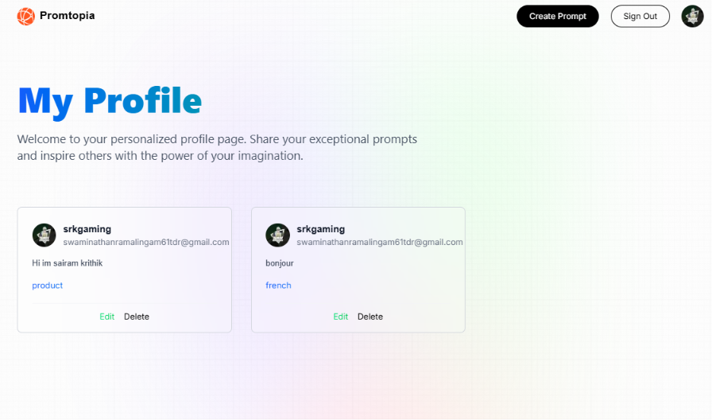

# 🤖 Promptopia

> **An open-source AI prompting tool for the modern world to discover, create, and share creative prompts.**

[](https://nextjs.org/)
[](https://react.dev/)
[](https://tailwindcss.com/)
[](https://www.mongodb.com/)

---

## 🎨 Screenshots & Preview

*Below are visual previews of Promptopia. Add your application screenshots in the `public/assets/screenshots` folder and reference them here.*

<p align="center">
  <strong>🏠 Homepage Feed</strong><br>
  
</p>

<table width="100%">
  <tr>
    <td width="50%" align="center">
      <strong>✨ Create & Edit Prompt Form</strong><br>
      
    </td>
    <td width="50%" align="center">
      <strong>👤 User Profile & Submissions</strong><br>
      
    </td>
  </tr>
</table>

---

## ✨ Features

- **🔍 Live Search & Filter**: Real-time searching of prompts by creators, specific tags, or keywords.
- **🏷️ Interactive Tags**: Click on tags on any prompt card to instantly filter the feed of related topics.
- **🔐 Google OAuth Authentication**: Secure user login using Google credentials via NextAuth.
- **📝 CRUD Operations**: 
  - **Create**: Write and tag prompts with ease.
  - **Read**: View shared prompts from creators around the globe.
  - **Update**: Edit your prompts instantly.
  - **Delete**: Remove your prompts anytime.
- **📋 Copy to Clipboard**: One-click prompt copying to easily paste directly into ChatGPT, Midjourney, Claude, or other LLMs.
- **👤 Personalized Profile Pages**: Dedicated dashboard listing all user-specific prompts with options to edit or delete them.
- **⚡ Next.js 15 & React 19 Powered**: Built on top of the latest features of Next.js App Router for optimal performance, API routes, and layouts.

---

## 🛠️ Tech Stack

- **Framework**: [Next.js](https://nextjs.org/) (App Router)
- **Library**: [React](https://react.dev/)
- **Database**: [MongoDB](https://www.mongodb.com/) with [Mongoose ODM](https://mongoosejs.com/)
- **Authentication**: [NextAuth.js](https://next-auth.js.org/)
- **Styling**: [Tailwind CSS](https://tailwindcss.com/)
- **Language**: JavaScript / JSX

---

## 🚀 Getting Started

### 📋 Prerequisites

Make sure you have the following installed:
- [Node.js](https://nodejs.org/) (v18.x or higher recommended)
- [MongoDB Atlas](https://www.mongodb.com/cloud/atlas) or a local MongoDB instance.
- Google Developer Console account (for Google OAuth API keys).

### ⚙️ Installation & Setup

1. **Clone the Repository**
   ```bash
   git clone https://github.com/your-username/promtopia.git
   cd promtopia
   ```

2. **Install Dependencies**
   ```bash
   npm install
   ```

3. **Configure Environment Variables**
   Create a `.env` file in the root directory (or rename `.env.example`) and fill in your credentials:
   ```env
   GOOGLE_ID=your_google_client_id
   GOOGLE_CLIENT_SECRET=your_google_client_secret
   MONGODB_URI=your_mongodb_connection_string
   NEXTAUTH_URL=http://localhost:3000
   NEXTAUTH_URL_INTERNAL=http://localhost:3000
   NEXTAUTH_SECRET=your_nextauth_secret_key
   ```
   > **Note**: You can generate a secure `NEXTAUTH_SECRET` by running: `openssl rand -base64 32` in your terminal.

4. **Run the Development Server**
   ```bash
   npm run dev
   ```

5. **Open Promptopia**
   Navigate to [http://localhost:3000](http://localhost:3000) in your browser to view the application.

---

## 📂 Project Structure

```text
promtopia/
├── app/                  # Next.js App Router routes & API endpoints
│   ├── api/              # API routes (Auth, prompt CRUD, user prompts)
│   ├── create-prompt/    # Create prompt page
│   ├── profile/          # User profile page
│   ├── update-prompt/    # Edit/update prompt page
│   ├── layout.jsx        # Root Layout wrapping the app
│   └── page.jsx          # Homepage featuring the feed
├── components/           # Reusable UI components (Feed, Nav, Profile, PromptCard, Form)
├── models/               # Mongoose Schemas (User, Prompt)
├── public/               # Static assets (images, icons, screenshots)
├── styles/               # CSS styling & global CSS imports
├── utils/                # Utility helpers & MongoDB connection config
├── .env.example          # Environment variables template
├── package.json          # Dependencies & npm scripts
└── tailwind.config.js    # Tailwind CSS layout configurations
```

---

## 📜 License

This project is open-source and available under the [MIT License](LICENSE).
